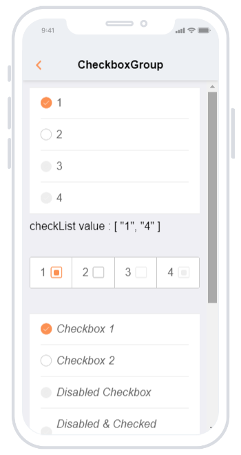
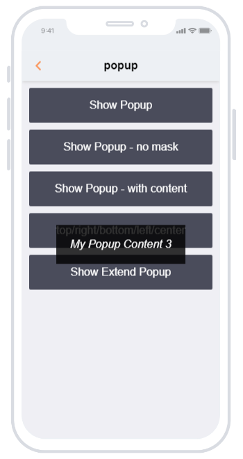

<Alert>
提示：这篇文章还没有被翻译，想帮助我们吗，点击页面末尾的 Edit this doc on GitHub。
</Alert>

## Cube-UI

  
  &nbsp;
  
  &nbsp;
  

[GitHub](https://github.com/didi/cube-ui) | [官方文档](https://didi.github.io/cube-ui/#/zh-CN/docs/introduction)

**项目分类**：UI 组件库 / 移动端

### 简介

Cube-UI 基于 Vue.js 实现的精致移动端组件库。2017 年 11 月 8 日消息，滴滴出行又开源了第二个项目 —— 基于 Vue.js 实现的移动端组件库 cube-ui ，宣布开源 Web 移动端组件库 cube-ui，该技术拥有质量可靠、体验极致、标准规范和强扩展性这四大特点，并拥有独特的后编译技术方案帮助大幅优化性能。

### 特性

<table border="0" width="100%">
  <tbody>
    <tr>
      <td width="25%" align="center">
         质量可靠 Quality
      </td>
      <td width="25%" align="center">
         体验极致 Experience
      </td>
      <td width="25%" align="center">
         标准规范 Standard
      </td>
      <td width="25%" align="center">
         扩展性强 Scalability
      </td>
    </tr>
    <tr>
      <td>由滴滴内部组件库精简提炼而来，历经考验，并且每个组件都有充分单元测试，为后续集成提供保障。</td>
      <td>以迅速响应、动画流畅、接近原生为目标，在交互体验方面追求极致。</td>
      <td>遵循统一的设计交互标准，高度还原设计效果；接口标准化，统一规范使用方式，开发更加简单高效。</td>
      <td>支持按需引入和后编译，轻量灵活；扩展性强，可以方便地基于现有组件实现二次开发。</td>
    </tr>
  </tbody>
</table>

### 组件介绍

<table border="0" width="100%">
  <thead>
    <tr>
      <th width="50%" align="left">基础</th>
      <th width="50%" align="center">展示(Button)</th>
    </tr>
  </thead>
  <tbody>
    <tr>
      <td>
        

          Button 按钮 
          按钮，提供了各种类型、样子、状态以及图标。
        

        

          Loading 加载中 
          加载，提供了可自定义大小的加载动画。
        

        

          Tip 提示 
          提示，用于弹出提示气泡框。
        

        

          Toolbar 工具条 
          工具栏，可以组合多个按钮，复选框操作为一个工具栏。(v 1.9.0 新增)
        

        

          TabBar 选项卡 
          选项卡。(v 1.10.0 新增)
        

      </td>
      <td>
        
      </td>
      </tr>
   </tbody>
</table>

<table border="0" width="100%">
  <thead>
    <tr>
      <th width="50%" align="center">展示(CheckboxGroup)</th>
      <th width="50%" align="left">表单</th>
    </tr>
  </thead>
  <tbody>
    <tr>
      <td>
        
      </td>
      <td>
        

          Checkbox 复选框 
          复选框，可设置其状态、传入特殊 class 以及复选框图标位置。
        

        

          CheckboxGroup 复选框组 
          复选框组就是一组复选框，主要用来选择一组可选项；有垂直和水平两种样式。
        

        

          Radio 单选框 
          单选框组，可设置单选框组内容，样式等。(v 1.4.0 新增)
        

        

          Input 输入框 
          输入框组件。支持使用v-model对数据双向绑定，支持一键清空内容。(v 1.5.0 新增)
        

        

          Textarea 
          多行输入框组件，支持使用v-model对数据双向绑定，根据是否有内容、是否聚焦有折叠、展开两种状态。(v 1.5.0 新增)
        

        

          Select 选择 
          Select 组件，用于单项选择。注： 由于此组件依赖 Picker 组件
        

        

          Switch 开关切换 
          滑动开关，用于切换 on/off 状态。(v 1.4.0 新增)
        

        

          Rate 评级 
          评分组件。你可以自定义星星个数，可以禁用交互，以用作评价展示，可以通过插槽自定义星星样式。(v 1.5.0 新增)
        

        

          Validator 校验器 
          校验器，用于对表单进行验证，并提示相应的错误信息。(v 1.5.0 新增)
        

        

          Upload 上传 
          Upload 上传组件。(v 1.3.0 新增)
        

        

          Form 表单 
          表单，包含各种输入组件以及对应的校验；我们可以通过数据驱动的方式来生成完成表单。(v 1.7.0 新增) 
          从 1.8.0 开始支持blur 时才触发校验以及 debounce，同 Validator 一样也开始支持异步校验。
        

      </td>
      </tr>
  </tbody>
</table>

<table border="0" width="100%">
  <thead>
    <tr>
      <th width="50%" align="left">弹层</th>
      <th width="50%" align="center">展示(Popup)</th>
    </tr>
  </thead>
  <tbody>
    <tr>
      <td>
        
注： 以下组件都是基于 create-api 实现，所以在使用之前，请确保自己了解过 create-api。

        

          Popup 
          底层弹层组件，主要用于基于此组件实现上层组件封装，只提供了基础功能：指定类型、是否有背景层、显示内容（HTML）以及是否居中。
        

        

          Toast 提醒 
          Toast组件主要用于非模态信息提醒，无需用户交互。
        

        

          Picker 选择器 
          Picker 组件也就是选择器，可以用于实现单列或多列选项的选择。
        

        

          CascadePicker 级联选择器 
          CascadePicker组件是级联选择器，用于实现多列选择之间的级联变化。
        

        

          DatePicker 日期选择器 
          日期选择器，可用于日期选择，选择粒度的灵活配置，如年月日、时分秒、年月日时分秒、年月等。
        

        

          TimePicker 时间选择器 
          TimePicker组件提供了常用的日期选择功能。
        

        

          SegmentPicker 段选择器 
          段选择器，用于实现多段的选择，比如选择时间段：2010年9月1日 - 2014年6月30日。(v 1.7.0 新增)
        

        

          Dialog 弹框 
          Dialog模态框组件，提供了多种样式及交互形式。
        

        

          ActionSheet 操作菜单 
          ActionSheet操作列表提供了两种常见的样式，灵活可控内容。
        

        

          Drawer 抽屉 
          抽屉，主要用来需要大范围层级进行选择的场景，一般情况下应该是满屏状态。
        

        

          ImagePreview 图片预览 
          图片预览，支持切换、放大缩小等能力。(v 1.10.0 新增)
        

      </td>
      <td>
        
      </td>
      </tr>
  </tbody>
</table>

<table border="0" width="100%">
  <thead>
    <tr>
      <th width="50%" align="left">展示(Swipe)</th>
      <th width="50%" align="center">滚动</th>
    </tr>
  </thead>
  <tbody>
    <tr>
      <td>
        
      </td>
      <td>
        
是一个基于better-scroll进行封装的组件。

        

          Scroll 滚动 
          滚动列表，提供了优质的原生滚动体验，便捷的配置项和事件。
        

        

          Slide 幻灯片 
          轮播图，提供了常见的轮播及 swipe 的功能。
        

        

          IndexList 索引列表 
          索引列表，提供了列表索引的功能。
        

        

          Swipe 滑块 
          滑块组件，提供类似微信列表左滑功能，可以方便地对列表项做一些功能操作。(v 1.5.0 新增)
        

        

          Sticky 吸附 
          吸附组件，当滚动位置到达目标元素位置后，目标元素就会自动吸附。
        

        

          ScrollNavBar 滚动导航条 
          滚动导航条组件，效果类似于滴滴打车业务线切换。(v 1.10.0 新增)
        

        

          ScrollNav 滚动导航 
          滚动导航组件。(v 1.10.0 新增)
        

        

          TabBar 选项卡 
          选项卡。(v 1.10.0 新增)
        

      </td>
      </tr>
  </tbody>
</table>

### 推荐理由

**可快速上手**
新手教程项目：[cube-application-guide](https://github.com/cube-ui/cube-application-guide)

**自定义主题**
移动端的组件对主题定制的需求会更多，从 `cube-ui^1.0.2` 开始，通过 webpack 工具可以实现自定义主题样式。

**使用后编译**
后编译指的是应用依赖的 NPM 包并不需要在发布前编译，而是随着应用编译打包的时候一块编译。

`注： 关于后编译更详细内容可参阅` [webpack 应用编译优化之路](https://github.com/DDFE/DDFE-blog/issues/23)

> 使用 webpack + babel 开发应用越来越多，而且一般都是通过 NPM 进行包管理的，这样依赖包越来越多，这些依赖包也是使用的 ES2015+ 开发的，所以每个依赖包都需要编译才能发布，这样编译后代码中往往后包含很多编译代码，所以为了消除这部分冗余，推荐大家使用后编译。

## Husky

&nbsp;

&nbsp;

[Github](https://github.com/typicode/husky)

**项目分类**：JavaScript / 实用工具

### 简介

husky，你没有看错，它就叫哈士奇 🐶

husky 是一个 Git Hook 工具

### 作用

husky 的作用相信在简介中就已经看到了，可能你并不理解它能为我们解决什么样的痛点

例如在我们进行团队协作时，每个人的代码风格不同，我们常常会使用编译器自动格式化自己喜欢的代码风格，但是再次提交代码时，由于与他人的风格不同，每次提交都会有很多更改，而这些更改都是代码风格上的更改，是没有必要的

也有的时候我们在代码提交前误删了一个逗号，但是自己并不知情就提交上去了，团队其他小伙伴并不知情，这是其他小伙伴拉下代码时就会报错

还有的时候团队中制定了 `commit` 规范，但是有小伙伴并不严格执行，就会造成后期一系列的麻烦事情

这个时候，就极度体现出了 `husky` 的作用，安装 `husky` 的时候，`husky` 会根据 package.json 里的配置，在 `.git/hooks` 目录生成 [所有](https://git-scm.com/docs/githooks) 的 `hook` 脚本（如果你已经自定义了一个 `hook` 脚本，`husky` 也不会覆盖它）

配合其他一些工具，它可以严格为我们把控这些问题，让我们的工作流更加规范、更加完善

### 推荐理由

- husky 十分简单，容易上手
- 它继承了 Git 下所有的钩子，在触发钩子的时候，husky 可以阻止不合法的 commit、push 等等
- 配合 [prettier](https://github.com/prettier/prettier) 工具，可以在代码提交前自动格式化代码
- 配合 [eslint](https://github.com/eslint/eslint) 工具，可以在代码提交前进行语法检测
- 配合 [commitlint](https://github.com/conventional-changelog/commitlint) 工具，可以在代码提交前检验 commit message 是否规范
- 配合 [lint-staged](https://github.com/okonet/lint-staged) 工具，可以只检查 staged 文件，从而提高效率

## Remaxjs/Remax

  
  &nbsp;
  
  &nbsp;
  

[Github](https://github.com/remaxjs/remax) | [插件地址](https://github.com/remaxjs/awesome-remax#%E6%8F%92%E4%BB%B6)

**项目分类**：JavaScript / 小程序

### 简介

1. 基于运行时的 React 方案，让你可以不受限制地使用 React 所有特性。
2. 支持阿里程序、微信小程序(QQ 小程序)、头条小程序以及 Web 应用的开发。
3. 默认支持 TypeScript 开发，提供完整的组件和 API 类型定义，为你的项目保驾护航

### 目前存在问题

1. 2.0 文档过于简单，有些问题需要直接阅读源码才能解决，如不 1.0 的文档丰富。
2. 社区插件丰富度不够，使用推广不够，出现问题需要开发者自己寻找

### 产品对比

|          | uniapp | Taro  | Remax |
| -------- | ------ | ----- | ----- |
| 语言模型 | VUE    | React | React |

### 推荐理由

1. 新版 2.0 基本兼容 React 语法，React 开发者可以无缝对接，同时带有 redux、mobx 状态管理，上手简单，开发迅捷
2. demo 完善，基本涵盖目前业务情况
3. 兼容多端，并支持单独拓展
4. 完美支持支付宝生态，例如 mpaas，支持在 app 中直接集成独立的小程序运行环境

## XiaoMi/soar

  
  &nbsp;
  
  &nbsp;
  

[GitHub](https://github.com/XiaoMi/soar)

**项目分类**：Go / 数据库

### 简介

SOAR(SQL Optimizer And Rewriter) 是一个对 SQL 进行优化和改写的自动化工具。 由小米人工智能与云平台的数据库团队开发与维护，具有命令行及 Web 可视化两种操作模式。

### 未来方向

- 语法支持方面，目前主要依赖 vitess,TiDB 对 SQL 语法的支持。
- 目前仅针对 MySQL 语法族进行开发和测试，其他使用 SQL 的数据库产品暂不支持。
- Profiling 和 Trace 功能有待深入挖掘，供经验丰富的 DBA 分析使用。
- 目前尚不支持直接线上自动执行评审通过的 SQL，后续会努力支持。
- 由于暂不支持线上自动执行，因此数据备份功能也未提供。
- Vim, Sublime, Emacs 等编辑器插件支持。
- Currently, only support Chinese suggestion, if you can help us add multi-language support, it will be greatly appreciated.

### 产品对比

|              | SOAR | sqlcheck | pt-query-advisor | SQL Advisor | Inception | sqlautoreview |
| ------------ | ---- | -------- | ---------------- | ----------- | --------- | ------------- |
| 启发式建议   | ✔️   | ✔️       | ✔️               | ❌          | ✔️        | ✔️            |
| 索引建议     | ✔️   | ❌       | ❌               | ✔️          | ❌        | ✔️            |
| 查询重写     | ✔️   | ❌       | ❌               | ❌          | ❌        | ❌            |
| 执行计划展示 | ✔️   | ❌       | ❌               | ❌          | ❌        | ❌            |
| Profiling    | ✔️   | ❌       | ❌               | ❌          | ❌        | ❌            |
| Trace        | ✔️   | ❌       | ❌               | ❌          | ❌        | ❌            |
| SQL 在线执行 | ❌   | ❌       | ❌               | ❌          | ✔️        | ❌            |
| 数据备份     | ❌   | ❌       | ❌               | ❌          | ✔️        | ❌            |

### 效果截图

### 推荐理由

1. 跨平台支持（支持 Linux, Mac 环境，Windows 环境理论上也支持，不过未全面测试）。
2. 目前只支持 MySQL 语法族协议的 SQL 优化。
3. 支持基于启发式算法的语句优化。
4. 支持复杂查询的多列索引优化（UPDATE, INSERT, DELETE, SELECT）。
5. 支持 EXPLAIN 信息丰富解读。
6. 支持 SQL 指纹、压缩和美化。
7. 支持同一张表多条 ALTER 请求合并。
8. 支持自定义规则的 SQL 改写。

## YMFE/yapi

  
  &nbsp;
  
  &nbsp;
  

[GitHub](https://github.com/YMFE/yapi) | [文档](https://hellosean1025.github.io/yapi) | [团队](https://github.com/YMFE)

**项目分类**：JavaScript / 实用工具

### 简介

YApi 是一个可本地部署的、打通前后端及 QA 的、可视化的接口管理平台

### 背景

现今的业务系统很少有孤立存在的，它们或多或少需要使用兄弟团队或是其他公司提供的服务，这给我们的联调和测试造成了麻烦。对于这种情况，我们常见的解决方案是搭建一个临时的 server，模拟那些服务，提供数据进行联调和测试。这就是 mock server 出现原因。

### 特性

1. 基于 Json5 和 Mockjs 定义接口返回数据的结构和文档，效率提升多倍
2. 扁平化权限设计，即保证了大型企业级项目的管理，又保证了易用性
3. 类似 postman 的接口调试
4. 自动化测试, 支持对 Response 断言
5. MockServer 除支持普通的随机 mock 外，还增加了 Mock 期望功能，根据设置的请求过滤规则，返回期望数据
6. 支持 postman, har, swagger 数据导入
7. 免费开源，内网部署，信息再也不怕泄露了

### 推荐理由

YApi 是高效、易用、功能强大的 api 管理平台，旨在为开发、产品、测试人员提供更优雅的接口管理服务。

YApi 可以帮助开发者轻松创建、发布、维护 API，YApi 还为用户提供了优秀的交互体验，开发人员只需利用平台提供的接口数据写入工具以及简单的点击操作就可以实现接口的管理。
